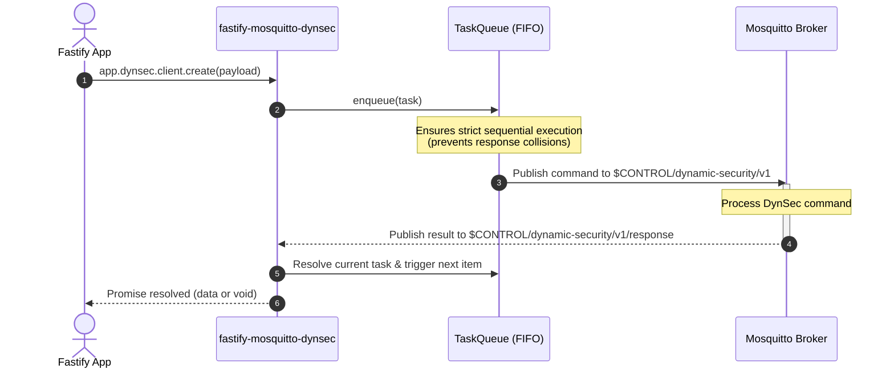

# fastify-mosquitto-dynsec

[](https://www.npmjs.com/package/fastify-mosquitto-dynsec)
[](https://www.npmjs.com/package/fastify-mosquitto-dynsec)
[](https://github.com/LuizTakeda/fastify-mosquitto-dynsec/actions)
[](./LICENSE)

Fastify plugin to manage [Mosquitto Dynamic Security](https://mosquitto.org/documentation/dynamic-security/) over MQTT.

Decorates your Fastify instance with `dynsec` (for administration of clients, roles, groups, and ACLs) and `mqtt` (the underlying MQTT client).

## Install

```bash
npm i fastify-mosquitto-dynsec
```

## Usage

```typescript
import Fastify from "fastify";
import dynsecPlugin from "fastify-mosquitto-dynsec";

const app = Fastify({ logger: true });

await app.register(dynsecPlugin, {
  url: "mqtt://localhost:1883",
  adminName: "admin",
  adminPassword: "adminPassword",
  failFast: true,
});

// Create a role with ACL permissions
await app.dynsec.role.create({
  rolename: "sensor-role",
  acls: [
    {
      acltype: "publishClientSend",
      topic: "sensors/+/data",
      allow: true,
    },
  ],
});

// Provision a new client and assign the role
await app.dynsec.client.create({
  username: "sensor-01",
  password: "superSecretPassword",
  roles: [{ rolename: "sensor-role" }],
});

await app.listen({ port: 3000 });
```

## How It Works

Mosquitto Dynamic Security processes commands through shared control topics. To prevent race conditions and response collisions when multiple requests occur concurrently, the plugin routes all commands through an internal FIFO `TaskQueue`:



## Options

`fastify-mosquitto-dynsec` accepts the following options:

| Option | Type | Default | Description |
| --- | --- | --- | --- |
| `url` | `string` | — | MQTT broker connection URL (e.g. `mqtt://localhost:1883`). |
| `adminName` | `string` | — | Mosquitto Dynamic Security administrator username. |
| `adminPassword` | `string` | — | Mosquitto Dynamic Security administrator password. |
| `clientId` | `string` | — | Optional MQTT client ID for the connection. |
| `failFast` | `boolean` | `false` | If `true`, awaits connection during `app.ready()` and rejects if connection fails. |
| `mqttClient` | `MqttClient` | — | Optional custom MQTT client instance (ignores `url` and credentials if passed). |
| `commandResponseTimeout` | `number` | `3000` | Timeout in milliseconds waiting for DynSec broker response. |
| `reconnectPeriod` | `number` | `1000` | Reconnection interval in milliseconds. |

## API Reference

### `fastify.dynsec.client`

Manage Mosquitto clients:

- `create(payload)`: Creates a client with optional password, roles, and groups.
- `get({ username })`: Retrieves client details, assigned roles, and groups.
- `list(payload?)`: Lists clients (supports `{ count, offset, verbose }`).
- `modify(payload)`: Updates client metadata, roles, or groups.
- `remove({ username })`: Deletes a client.
- `enable({ username })`: Enables client authentication.
- `disable({ username })`: Disables a client and disconnects active sessions.
- `setPassword({ username, password })`: Updates a client's password.
- `setId({ username, clientid? })`: Sets or clears a client ID restriction.
- `addRole({ username, rolename, priority? })`: Assigns a role to a client.
- `removeRole({ username, rolename })`: Unassigns a role from a client.
- `addToGroup({ username, groupname, priority? })`: Adds a client to a group.
- `removeFromGroup({ username, groupname })`: Removes a client from a group.

### `fastify.dynsec.role`

Manage roles and topic ACLs:

- `create(payload)`: Creates a role with optional ACL rules.
- `get({ rolename })`: Retrieves role details and associated ACLs.
- `list(payload?)`: Lists roles (supports `{ count, offset, verbose }`).
- `modify(payload)`: Modifies role metadata or ACLs.
- `remove({ rolename })`: Deletes a role.
- `addACL({ rolename, acltype, topic, allow?, priority? })`: Adds an ACL rule (`publishClientSend`, `publishClientReceive`, `subscribePattern`, `subscribeLiteral`, etc.).
- `removeACL({ rolename, acltype, topic })`: Removes an ACL rule from a role.

### `fastify.dynsec.group`

Manage groups and hierarchy:

- `create(payload)`: Creates a group with optional initial roles.
- `get({ groupname })`: Retrieves group details, assigned roles, and members.
- `list(payload?)`: Lists groups (supports `{ count, offset, verbose }`).
- `modify(payload)`: Updates group metadata, roles, or members.
- `remove({ groupname })`: Deletes a group.
- `addClient({ groupname, username, priority? })`: Adds a client to a group.
- `removeClient({ groupname, username })`: Removes a client from a group.
- `addRole({ groupname, rolename, priority? })`: Adds a role to a group.
- `removeRole({ groupname, rolename })`: Removes a role from a group.
- `setForAnonymousClients({ groupname })`: Sets the group for unauthenticated clients.
- `getForAnonymousClients()`: Gets the current anonymous group configuration.

### `fastify.dynsec.acl`

Manage global default permissions:

- `getDefaultAccess()`: Returns default access rules for all ACL types.
- `setDefaultAccess({ acls })`: Updates default access permissions (`publishClientSend`, `publishClientReceive`, `subscribe`, `unsubscribe`).

### `fastify.dynsec.sendCommands`

Executes raw Dynamic Security JSON commands sequentially via internal FIFO queue:

```typescript
const result = await fastify.dynsec.sendCommands({
  commands: [
    { command: "listClients", count: 10, offset: 0 }
  ]
});
```

### Errors

The plugin exports `DynsecError`:

```typescript
import { DynsecError } from "fastify-mosquitto-dynsec";

try {
  await fastify.dynsec.client.get({ username: "unknown-user" });
} catch (err) {
  if (err instanceof DynsecError) {
    console.error(err.command); // "getClient"
    console.error(err.message); // Broker error message
  }
}
```

## License

[MIT](./LICENSE)
